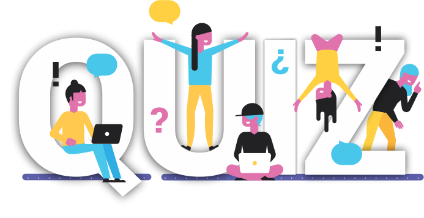

<h1 align="center">
   
</h1>

<h1>
</h1>

# Indice

- [Sobre](#-sobre)
- [Tecnologias Utilizadas](#-tecnologias-utilizadas)
- [Como baixar o projeto](#-como-baixar-o-projeto)

## 🔖&nbsp; Sobre

O projeto **Quiz projeto destaque** é um sistema para perguntas e respostas que foi criado dentro do projeto **Robótica Aplicada à Disseminação de Conceitos de Programação** com o intuito de divulgar e complementar as formas de disseminação do projeto.

---

## 🚀 Tecnologias utilizadas

O projeto foi desenvolvido utilizando as seguintes tecnologias

- [ReactJS](https://reactjs.org)
- [Axios](https://github.com/axios/axios)
- [NodeJS](https://nodejs.org/en/)
---

## 🗂 Como baixar o projeto

```bash

    # Clonar o repositório
    $ git clone https://github.com/herculests/quiz_projeto_destaque.git

    # Entrar no diretório
    $ cd quiz_projeto_destaque

    # Instalar as dependências
    $ yarn install

    # Iniciar o projeto
    $ yarn start:dev
```

---

Desenvolvido por Henrique Hercules
